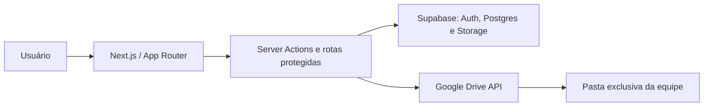

# ProjetoHub

Plataforma para organizar equipes, tarefas, entregas e arquivos de projetos em um só lugar. O ProjetoHub usa dados reais do Supabase; não há conteúdo de demonstração nem registros mockados na aplicação.

## O que o projeto entrega

- Cadastro, login, confirmação por e-mail e encerramento de sessão.
- Página inicial com as equipes do usuário, tarefas pendentes, prazos e atividade recente.
- Criação e edição de equipes, com foto opcional e área privada de arquivos.
- Convites por link, com expiração e possibilidade de revogação.
- Papéis de membro: leitor, editor, co-líder e líder.
- Criação, envio e revisão de tarefas, comentários e relatórios da equipe.
- Integração opcional com Google Drive para cada equipe: conexão OAuth, upload, listagem e download de arquivos.
- Sete temas persistidos no navegador: Light, Dark, Dark OLED, Neon, Tokyo Lights, Black Green e Black Purple.
- Páginas públicas de [privacidade](./projetohub/app/privacy-police/page.tsx) e [termos de serviço](./projetohub/app/terms-of-service/page.tsx).

## Arquitetura



A interface e as rotas estão em `projetohub/`; o Supabase concentra autenticação, banco e armazenamento de fotos. A integração do Drive é processada no servidor: os tokens do Google não são enviados ao navegador.

## Tecnologias

| Camada | Tecnologia |
| --- | --- |
| Aplicação | Next.js 16, React 19 e TypeScript |
| Estilos | Tailwind CSS 4 e CSS próprio |
| Autenticação, banco e storage | Supabase (`@supabase/ssr` e `@supabase/supabase-js`) |
| Arquivos de equipe | Google Drive API, via OAuth 2.0 |
| Qualidade | ESLint, TypeScript e npm audit |

## Papéis e permissões

| Ação | Leitor | Editor | Co-líder | Líder |
| --- | :---: | :---: | :---: | :---: |
| Ver equipe, tarefas, relatórios e arquivos | ✓ | ✓ | ✓ | ✓ |
| Baixar arquivos do Drive | ✓ | ✓ | ✓ | ✓ |
| Comentar, enviar tarefa e fazer upload | — | ✓ | ✓ | ✓ |
| Criar tarefas, revisar entregas, gerar relatório e gerir convites | — | — | ✓ | ✓ |
| Conectar/desconectar o Google Drive | — | — | ✓ | ✓ |
| Alterar cargos e remover membros | — | — | — | ✓ |

As permissões não dependem apenas da interface: elas são verificadas nas Server Actions, nas rotas da API e pelas políticas de Row Level Security (RLS) do Supabase.

## Estrutura do repositório

```text
ProjetoHub/
├── README.md
└── projetohub/
    ├── app/                    # páginas, Server Actions e rotas da API
    ├── components/             # componentes da interface
    ├── lib/google-drive/       # OAuth, criptografia e operações do Drive
    ├── utils/supabase/         # clientes Supabase para browser, servidor e middleware
    ├── supabase/migrations/    # esquema, RLS, funções e políticas
    ├── email-templates/        # template de confirmação de cadastro
    └── public/                 # imagens e ícones públicos
```

Rotas principais:

| Rota | Finalidade |
| --- | --- |
| `/` | Painel inicial autenticado |
| `/login` | Acesso à conta |
| `/cadastro` | Criação de conta |
| `/equipes/nova` | Criação de equipe |
| `/equipes/[teamId]` | Espaço de trabalho de uma equipe |
| `/convite/[token]` | Aceite de convite |
| `/privacy-police` | Política de privacidade |
| `/terms-of-service` | Termos de serviço |

## Modelo de dados

O banco possui as entidades abaixo, todas protegidas por RLS:

- `profiles`: perfil público básico de cada pessoa.
- `teams`: equipes e suas configurações.
- `team_members`: vínculo entre pessoas, equipes e papéis.
- `team_invites`: convites com token, validade e status.
- `tasks` e `task_comments`: tarefas, entregas, avaliações e conversas.
- `activity_events`: histórico de atividades.
- `team_reports`: relatórios gerados para a equipe.
- `team_drive_connections`: conexão criptografada de uma equipe ao Drive.

As fotos de equipes ficam no bucket privado `team-photos`, e o acesso também é controlado pelas políticas do Supabase.

## Pré-requisitos

- Node.js em versão LTS recente (20 ou superior recomendado).
- Uma conta e projeto no Supabase.
- Para usar arquivos no Drive, um projeto no Google Cloud com a Google Drive API ativada.

## Instalação local

```bash
git clone <URL_DO_REPOSITORIO>
cd ProjetoHub/projetohub
npm install
```

Crie `projetohub/.env.local` a partir do exemplo abaixo. Não envie esse arquivo ao Git e nunca use a chave `service_role` no cliente.

```env
NEXT_PUBLIC_SUPABASE_URL=https://SEU-PROJETO.supabase.co
NEXT_PUBLIC_SUPABASE_PUBLISHABLE_KEY=sb_publishable_SUA_CHAVE

# Necessárias apenas para a integração com Google Drive
GOOGLE_DRIVE_CLIENT_ID=SEU_CLIENT_ID.apps.googleusercontent.com
GOOGLE_DRIVE_CLIENT_SECRET=SEU_CLIENT_SECRET
GOOGLE_DRIVE_REDIRECT_URI=http://localhost:3000/api/integrations/google-drive/callback

# Recomendado: segredo longo, aleatório e exclusivo para criptografar tokens do Drive.
GOOGLE_DRIVE_TOKEN_ENCRYPTION_KEY=UM_SEGREDO_LONGO_E_ALEATORIO
```

`GOOGLE_DRIVE_TOKEN_ENCRYPTION_KEY` é opcional por compatibilidade, mas deve ser configurada em produção. Sem ela, o sistema usa o segredo OAuth como alternativa de criptografia.

Inicie o ambiente local:

```bash
npm run dev
```

Abra `http://localhost:3000`.

## Configuração do Supabase

### 1. Aplicar o esquema

Instale a CLI do Supabase se necessário, autentique-se, vincule o projeto e aplique todas as migrações versionadas:

```bash
npx supabase login
npx supabase link --project-ref SEU_PROJECT_REF
npx supabase db push
```

As migrações em [`projetohub/supabase/migrations`](./projetohub/supabase/migrations) criam o modelo colaborativo, as políticas RLS, as funções usadas pela aplicação, o histórico de contribuições, a integração do Drive e os reforços de segurança.

### 2. Configurar autenticação

No painel do Supabase, em **Authentication → URL Configuration**:

- Defina a URL do site para a URL local ou de produção correspondente.
- Adicione as URLs de redirecionamento permitidas, incluindo `http://localhost:3000/**` no desenvolvimento e o domínio da Vercel em produção.
- Ative a confirmação de e-mail se quiser exigir validação antes do primeiro acesso.

O template pronto para confirmação está em [`projetohub/email-templates/confirmacao-cadastro.html`](./projetohub/email-templates/confirmacao-cadastro.html). Cole seu conteúdo em **Authentication → Email Templates → Confirm signup**. Ele usa a variável do Supabase `{{ .ConfirmationURL }}`.

Também é recomendado habilitar a proteção contra senhas vazadas em **Authentication → Password Security**.

## Configuração do Google Drive

A integração cria ou reutiliza uma pasta própria para cada equipe e opera apenas nela. O escopo utilizado é `https://www.googleapis.com/auth/drive.file`, que limita o acesso aos arquivos criados ou abertos pela aplicação.

1. No Google Cloud Console, crie ou selecione um projeto e ative a **Google Drive API**.
2. Configure a tela de consentimento OAuth.
3. Crie uma credencial OAuth 2.0 do tipo **Web application**.
4. Em **Authorized redirect URIs**, cadastre exatamente a URL de `GOOGLE_DRIVE_REDIRECT_URI`.
5. Preencha as quatro variáveis `GOOGLE_DRIVE_*` no ambiente local e de produção.
6. No ProjetoHub, entre na equipe como co-líder ou líder e conecte o Drive pela área de arquivos.

Em produção, o redirecionamento OAuth deve usar HTTPS. O único HTTP aceito pelo código é `localhost` ou `127.0.0.1` para desenvolvimento.

## Segurança

- Autenticação baseada em sessão do Supabase, atualizada pelo middleware.
- RLS ativado nas tabelas expostas; a autorização é feita pelo usuário autenticado e pelo vínculo de membro da equipe.
- Operações sensíveis validam identificadores, tamanho de texto, datas e papéis permitidos no servidor.
- Convites usam tokens aleatórios, expiração e revogação.
- Rotas que alteram dados validam a origem da requisição para reduzir risco de CSRF.
- Upload de foto aceita somente JPEG, PNG e WebP, verifica assinatura do arquivo e limita o tamanho a 5 MB.
- Tokens de atualização do Google Drive são criptografados com AES-256-GCM antes de serem persistidos.
- Uploads para o Drive têm limite de 250 MB e downloads só são liberados para arquivos pertencentes à pasta raiz da equipe.
- Cabeçalhos HTTP incluem CSP, HSTS, proteção contra clickjacking, MIME sniffing e permissões de navegador restritas.

## Comandos úteis

Execute os comandos dentro de `projetohub/`:

```bash
npm run dev          # desenvolvimento
npm run lint         # análise estática
npx tsc --noEmit     # verificação de tipos
npm run build        # build de produção
npm start            # executar o build
npm audit            # auditoria de dependências
```

## Deploy na Vercel

1. Importe o repositório na Vercel.
2. Defina **Root Directory** como `projetohub`.
3. Cadastre as variáveis de ambiente do `.env.local` no ambiente de produção; não copie arquivos de ambiente para o repositório.
4. Aplique as migrações do Supabase no projeto de produção antes de publicar funcionalidades dependentes do banco.
5. Atualize no Supabase as URLs de site e redirecionamento com o domínio final da Vercel.
6. Atualize no Google Cloud a URI de retorno para `https://SEU_DOMINIO/api/integrations/google-drive/callback`.

Após o deploy, valide pelo menos: cadastro/confirmação, login, criação de equipe, convite, regras de cargo, upload de foto e conexão/download de arquivo do Google Drive.

## Ícones e identidade visual

Os ícones do aplicativo estão em `projetohub/app/icon.png`, `projetohub/app/apple-icon.png`, `projetohub/app/favicon.ico` e `projetohub/public/projetohub-icon.png`.

## Licença

Este repositório ainda não possui uma licença declarada.
